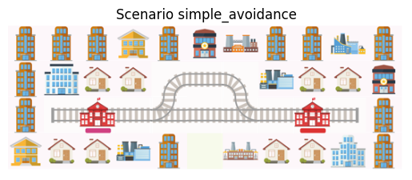
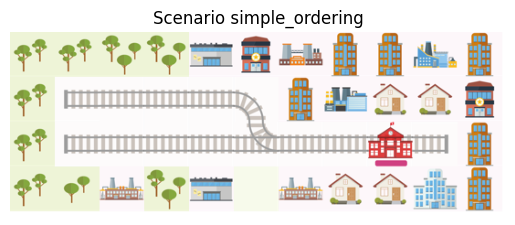
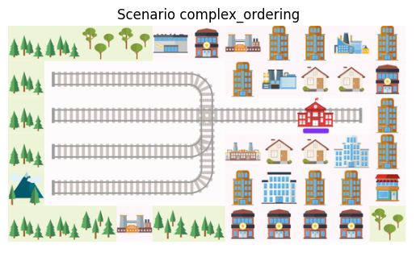
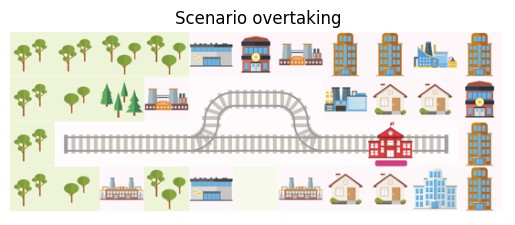

# Flatland Test Scenarios
The environments and scenarios contained here are created using the drawing board created by Manuel Meyer @ Flatland Association. Each scenario contains a physical network topology, stations, lines and schedule. Lines consist of a series of stations, schedules define the earliest departure and latest arrive times at each station, and is operated by a specific train type. Train types currently only differentiate themselves in speed, but can also be used to set priorities (i.e., an InterCity could be prioritised over cargo trains). In the following, the test scenarios are visualised together with their schedules, and the characteristic aimed to be tested with the scenario. 

## Simple Avoidance

| Station | Latest Arrival Time         | Earliest Departure Time      |
|---------|-----------------------------|------------------------------|
| **Schedule W-E** |
| 1       | N/A                         | 1.0                          |
| 2       | 10                          | N/A                          |
| **Schdule E-W** |
| 2       | N/A                         | 1.0                          |
| 1       | 10                          | N/A                          |

## Complex Avoidance
Complex avoidance is topologically identical to simple avoidance, however in this scenario, three trains are considered - one moving from west-east, and two moving east-west. The aim of this scenario is to test whether the agents can identify that the optimal solution is to route the two agents moving east-west via the shorter path. 

| Station | Latest Arrival Time         | Earliest Departure Time      |
|---------|-----------------------------|------------------------------|
| **Line W-E** |
| 1       | N/A                         | 1.0                          |
| 2       | 10                          | N/A                          |
| **Line E-W 1** |
| 2       | N/A                         | 1.0                          |
| 1       | 10                          | N/A                          |
| **Line E-W 2** |
| 2       | N/A                         | 3.0                          |
| 1       | 12                          | N/A                          |

## Simple Ordering
The simple ordering scenario aims to test the ability of the agents to organise themselves according to given priorities when merging at a switch. Two lines exist: 
- Line 1.1: from upper rail of station 1 via station 7 to final station 8
- Line 1.2: from lower rail of station 1 via station 7 to final station 8

(currently there is an issue with station visualisation - only final stations are visualised by the flatland renderer. Station 7 is at ``(1,2)`` and ``(2,2)``, station 8 is at ``(2,6)``)

| Station | Latest Arrival Time         | Earliest Departure Time      |
|---------|-----------------------------|------------------------------|
| **Line 1.1** |
| 1       | N/A                         | 1.0                          |
| 7       | 6                           | 8                            |
| 8       | 11                          | N/A                          |
| **Line 1.2** |
| 1       | N/A                         | 0                            |
| 7       | 5                           | 7                            |
| 8       | 10                          | N/A                          |

## Complex Ordering
The complex ordering scenario tests the same behaviour as the simple ordering scenario, with more tracks merging before the stations.

(Currently not working & needs to be fixed - merge switch)

## Overtaking
This scenario, as the name indicates, tests how agents initiate overtaking when the train behind is faster than the train ahead. 

| Station | Latest Arrival Time         | Earliest Departure Time      |
|---------|-----------------------------|------------------------------|
| **Line W-E Fast** |
| 1       | N/A                         | 2.0                          |
| 2       | 10                          | N/A                          |
| **Line W-E Slow** |
| 1       | N/A                         | 1.0                          |
| 7       | 14                          | N/A                          |

