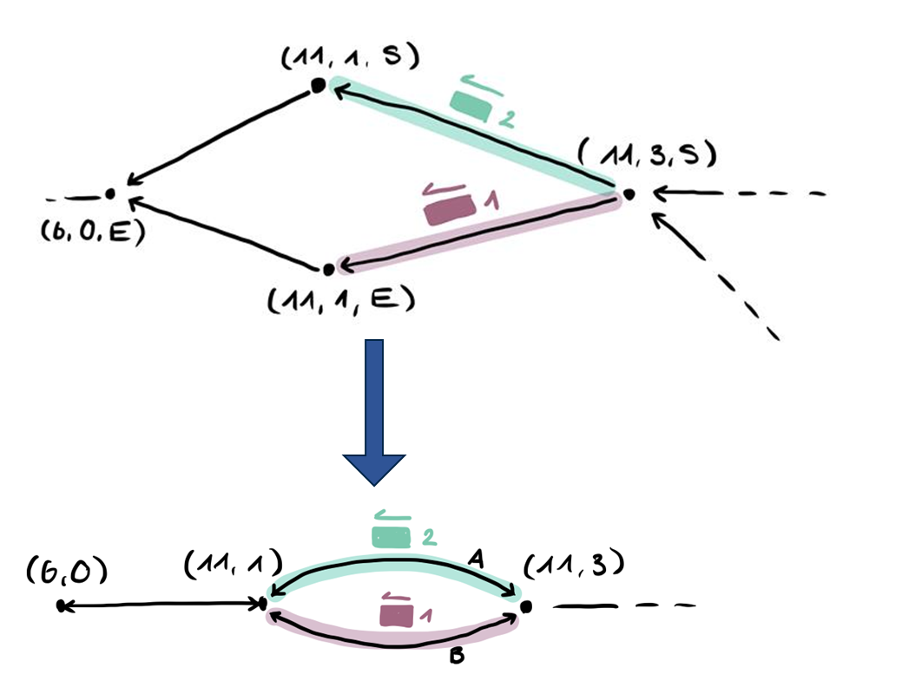

# Graph Extension
This folder contains ``FlatlandGraph``, a translation of the flatland environment into a graph environment, which allows for simple path identification and serves as the basis for [negotiation](https://github.com/ozmanda/AI4REALNET-T3.4/tree/main/src/negotiation). The following classes are defined: 
1. **``FlatlandGraph``**: wraps the various functionalities into a single, accessible class. 
1. **``MultiDiGraphBuilder``**: constructs a multi-di graph (see [networkx documentation](https://networkx.org/documentation/stable/reference/classes/multidigraph.html)) from the flatland environment.
1. **``PathGenerator.py``**: contains functions for the generation of paths between arbitrary nodes in the graph.
1. **``ConflictPredictor``**: predicts conflicts on the basis of planned path, agent location and agent speed.

## MultiDiGraphBuilder
The original graph implementation by Adrian resulted in a graph in which each switch could have up to four nodes, making pathfinding within the graph very efficient. For message propagation, however, it is essential for spatially "close" nodes to be near each other in the graph. Similarly to ``FlatlandGraphBuilder`` class, the ``MultiDiGraphBuilder`` class transforms a flatland ``RailEnv`` into a ``MultiDiGraph`` from the ``networkx`` package. The key difference between the ``DiGraph`` and ``MultiDiGraph`` is that the ``MultiDigrpah`` allows for multiple directed edges between nodes, thereby more closely representing the network topology. Nodes which are close to each other in real life are also clustered in the ``MultiDiGraph``, whereas in the ``DiGraph``, the focus is on paths rather than network topology. 

The graph contains the following network information in the form of node and edge attributes: (WIP)
- **Node Attributes**
    - ``dead_end``: indicates whether the node is a dead end

- **Edge Attributes** 
    - ``station_ID``: if the node is a station, its ID is saved
    - ``rail_ID``: the ID of the rail cluster the edge belongs to
    - ``out_direction``: the direction of travel from the origin node
    - ``in_direction``: the direction of travel to the destination node
    - ``length``: the length of the edge (number of cells)
    - ``resources``: list of cells in the edge and including their travel direction, forming the tuple ((x,y), travel_direction). The origin and destination cells are not included in the list, only the cells in between the nodes.
    - ``max_speed``: max speed along the edge (WIP)

## PathGenerator

### 2. Shortest Path Calculation 
Using the `MultiDiGraph` constructed by ``MultiDiGraphBuilder``, paths between the nodes in the graph can be calculated. This function is used to identify the k-shortest paths between each station pair. This is done under the assumption that agents learn in static environments, which represents the real-world, where network topologies do not change significantly over time. 

The ``PathGenerator`` class from ``utils.graph.paths.py`` determines the k-shortest paths between station nodes in the graph. The current workaround transforms the ``MultiDiGraph`` into a normal ``DiGraph``, calculates the shortest paths, and then reestablishes the ``MultiDiGraph`` afterwards. The ``PathGenerator`` also contains functions to determine the occupancy times of nodes and edges, thereby allowing for conflict detection. 

## Conflict Identification
Given a path consisting of one or multiple edges, the expected entry and exit time of each path segment can be calculated, which is then used to identify potential conflicts. The identification of path conflicts serves to support the initialisation of agent negotiation.